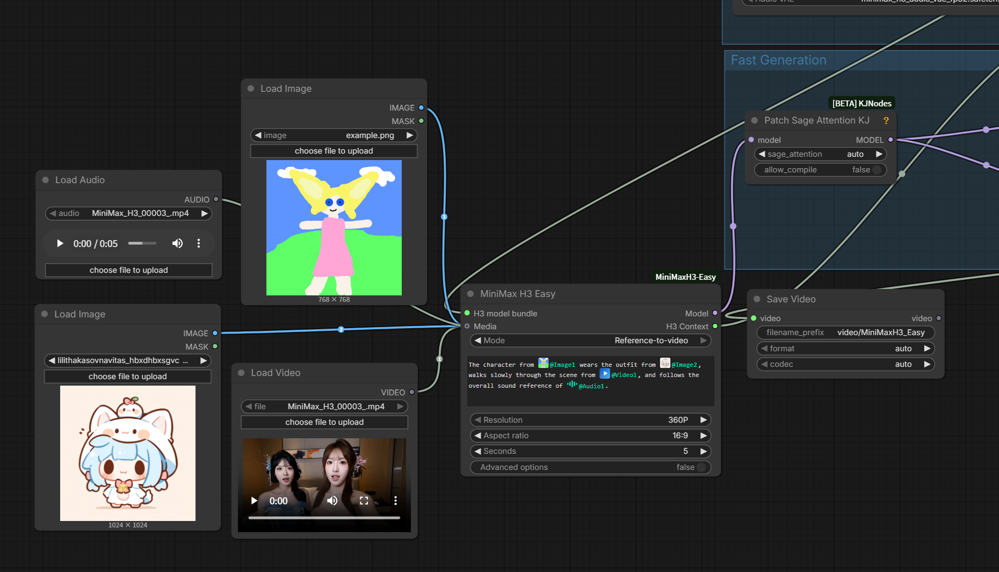
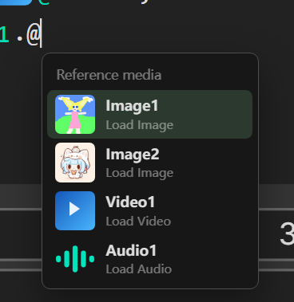

# ComfyUI-MiniMaxH3-Studio

[中文说明](README_CN.md)

A script editor for MiniMax H3. It hides the official six-section reference grammar
and lets you write content instead — the `MiniMax H3 Easy` node grows a
**📝 Edit script** button, and everything happens in there.

Subject/Speaker numbering, timecodes, `<d>` dialogue tags, retention declarations and
the official binding sentences are all assembled for you at save time.

It also ships the two things that otherwise stall a first install: a **one-click model
downloader** and **example workflows that use nothing but core ComfyUI nodes**.

<p align="center">
  
</p>

<sup>Images, video and audio all share one sortable `Media` input, and the prompt box
references them inline as `@name`. The script editor sits on top of this.</sup>

---

## Install

```bash
git clone https://github.com/coasho/ComfyUI-MiniMaxH3-Studio.git
```

Clone it into `ComfyUI/custom_nodes/`, then install the optional extras and restart:

```bash
pip install -r ComfyUI-MiniMaxH3-Studio/requirements.txt
```

The three nodes themselves need nothing beyond what ComfyUI already has.
`requirements.txt` only covers the editor's optional features (captioning, voice) — if
a package is missing, that feature reports it and the nodes keep working.

**ComfyUI ≥ `bdcb886` (2026-08-06 nightly) is strongly recommended.** That commit adds
native MiniMax-H3 AV flow sampling (`ModelSamplingAV`); before it, the 4-step Turbo LoRA
produced badly clipped audio. The example workflows are built around the Turbo LoRA.

Voice generation additionally needs [ComfyUI-Qwen3-TTS](https://github.com/lrzjason/ComfyUI-Qwen3-TTS)
installed alongside this package — it owns the TTS node classes this editor drives.

---

## One-click model download

The H3 checkpoints live across three HuggingFace repos under near-identical names, and
you need six files before anything runs. Don't copy links by hand.

Open the **MiniMax H3 Easy Loader** node and press **⬇ 下载模型 / Download models**.
It shows what is present, what is missing, and how many bytes each one still needs.
The same button appears inside the captioning and voice dialogs when their model is absent.

Or from a terminal, without starting ComfyUI:

```bash
python ComfyUI/custom_nodes/ComfyUI-MiniMaxH3-Studio/download_models.py --list
```

```bash
python ComfyUI/custom_nodes/ComfyUI-MiniMaxH3-Studio/download_models.py --required
```

| id | required | size | goes to |
|---|---|---|---|
| `h3_ref2va` | ✔ | 19.5 GB | `models/diffusion_models/` |
| `h3_fl2va` | ✔ | 19.5 GB | `models/diffusion_models/` |
| `h3_text_encoder` | ✔ | 14.6 GB | `models/text_encoders/` |
| `h3_text_encoder_int8` | — | 25.3 GB | alternative for pre-Blackwell GPUs |
| `h3_vae` | ✔ | 5.4 GB | `models/vae/` (video + audio VAE) |
| `h3_turbo_lora` | ✔ | 592 MB | `models/loras/` |
| `qwen3vl_caption` | — | 8.3 GB | `models/LLM/Qwen3-VL-4B-Instruct/` |
| `wd14_tagger` | — | 1.2 GB | reuses `comfyui-wd14-tagger/models/` if installed |
| `tts_voicedesign` | — | 4.2 GB | `models/TTS/Qwen/…-VoiceDesign/` |
| `tts_base` | — | 4.2 GB | `models/TTS/Qwen/…-Base/` |

Details that matter in practice:

- **Resumable.** Downloads land as `.part` next to the target and continue from wherever
  they stopped — cancel, close ComfyUI, lose the connection, it picks up. `huggingface_hub`'s
  `snapshot_download(local_dir=…)` has no resume on Xet storage, so this uses plain
  `Range` requests with its own read timeout instead.
- **No second copy.** Files go straight to the ComfyUI models directory, not through
  `~/.cache/huggingface`.
- **Mirrors.** Set `HF_ENDPOINT=https://hf-mirror.com` and it goes there.
- **Verified.** `.safetensors` are checked against their own header before being renamed
  into place, so a half-downloaded file never reports itself ready. Files already on disk
  are trusted if they self-verify, even if their byte count differs from the manifest
  (repacks of the same weights differ by a few dozen bytes).

---

## Example workflows

`example_workflows/` contains two graphs that use **only core ComfyUI nodes plus this
package's three nodes** — no KJNodes, no wavespeed, no patched samplers.

| File | Mode | Needs |
|---|---|---|
| `MiniMax_H3_Studio_Reference.json` | reference-to-video | `h3_ref2va` + text encoder + VAEs + Turbo LoRA |
| `MiniMax_H3_Studio_TextToVideo.json` | text-to-video | `h3_fl2va` + text encoder + VAEs + Turbo LoRA |

Both come with a short demo script already loaded, so opening the editor shows a filled-in
structure rather than a blank form. The reference one points at `input/example.png`, which
ships with ComfyUI; swap in your own reference sheet.

---

## The entity model

**The official `<Subject N>` is not just "a character."** It is any reusable declared
entity. The full set of official visible content types:

| Kind | Official phrase | Default retention |
|---|---|---|
| Person | `identity and appearance` | fully_preserved |
| Object / clothing / prop | `visible object appearance` | fully_preserved |
| Scene / environment | `scene and environment` | fully_preserved |
| Action / pose | `pose and movement` | **attribute_transfer** (needs a transfer target) |
| Art style | `visual style` | weak_reference |
| Off-screen voice | none (takes no Subject number) | — |

Binding sentence: `The {phrase} of <Subject 1> {is|are} defined by <Picture 1>.`
**One entity can bind several references** (front view + side view + a costume detail).

### The two numbering schemes are independent

- `<Subject N>` follows **declaration order**, and only on-screen entities take a number
- `(S1)(S2)` follows **first-speaking order**, and entities that never speak get none

So `<Subject 2> (S1)` is perfectly valid. Each card shows the numbers it will actually emit.

### How to express the awkward cases

| You want | Do this |
|---|---|
| Several characters talking | One "person" entity each; pick the speaker on the line card |
| A different voice per character | Bind a voice reference to each entity |
| Changing clothes mid-shot | Two "object" entities, then shot **beats**: "A removes uniform", "A wears red coat" |
| A hands something to B | Beat kind "give", with three slots: who / what / to whom |
| Anything stranger than that | Beat kind "custom", write the sentence yourself — `@` references still work |
| No characters at all, just objects and scenery | Only object and scene entities, zero dialogue. Validation stays quiet |
| One speaks Japanese, another Chinese | Set the language per entity; `<d>[Lang]` is emitted per line |

### `@` references

Shot descriptions, beats, the summary and the soundscape all accept `@entityName`, resolved
to `<Subject N>` on save. Typing `@` opens a completion list you drive with ↑ ↓ and Enter.
Unresolved references are flagged in red and reported by validation.

<p align="center">
  
</p>

---

## Image-to-text captioning (🔍)

Stop rewriting the appearance you already have in a reference sheet. Every reference binding
on an entity card has a caption button.

Two models cooperate — this is not an either/or:

| Model | Size | Job |
|---|---|---|
| `SmilingWolf/wd-eva02-large-tagger-v3` | 1.2 GB ONNX | Anime attribute extraction (best F1 in the v3 line, 0.4772) |
| `Qwen/Qwen3-VL-4B-Instruct` | 8.3 GB bf16 | Writes sentences; good on both photoreal and anime |

For anime images WD14 tags are extracted first and handed to the VLM **as ground truth**,
with an explicit instruction that the tags beat its own reading on hair/eye/clothing colour.
For photographs the tags are skipped.

A third backend is any **OpenAI-compatible endpoint** (Ollama, LM Studio, a cloud API) —
zero download, fill in the URL in the dialog.

### Character-sheet layout artifacts are separated out

WD14 also picks up `multiple views / turnaround / white background / spread arms` — these
describe *that it is a character sheet*, not what the character looks like. Left in the
description, H3 copies them into the frame (a T-pose on white *has* shown up in output).

They are pulled out into **"not retained"** candidates you can tick straight into the script.
Viewpoint tags are only proposed for removal when the image is actually a sheet — `profile`
in a single side-view close-up is real composition, not an artifact.

---

## Voice generation (🎙)

**The "middle-aged auntie voice" problem is a selection problem, not a model problem.**
VoiceDesign samples randomly; the same description with a different seed sounds quite
different (measured intra-group similarity 0.989 — it really does drift). So the point of
this panel is **several candidates side by side, auditioned before you commit**.

| Source | Model | Notes |
|---|---|---|
| Describe it | `Qwen3-TTS-12Hz-1.7B-VoiceDesign` 4.2 GB | Free-text description, random sampling — generate a few and pick |
| Clone a reference | `Qwen3-TTS-12Hz-1.7B-Base` 4.2 GB | `x_vector_only` timbre vector from reference audio. No dice-rolling |

**CustomVoice is deliberately not used** — that fixed Vivian preset is where the auntie
voice actually comes from.

Measured timbre consistency (MFCC cosine): design intra-group 0.989, clone intra-group 0.997,
clone across references 0.980 — cloning is tighter, and the reference genuinely decides the
timbre. (The metric saturates towards 1.0 on short clips; trust your ears.)

- **The audition text defaults to that entity's first real line from the script**, so you
  hear the sentence that will be in the film
- The chosen voice is written to `input/h3voice_*.wav` — reusable across scripts and restarts
- Picking it **creates a `LoadAudio` node, fills in the filename, registers it as media and
  binds it to the entity** automatically; re-picking the same file reuses the existing node

> Voice files must sit in the **root** of `input/`: `LoadAudio` lists files with
> `os.listdir(input_dir)` and does not recurse, so anything in a subdirectory is invisible
> in its dropdown.

---

## Chinese in, English out

Editing in Chinese is far faster, but H3 wants English. On save, every prose field is sent
through **Qwen3-VL as a translator** — not a lookup table — while:

- **dialogue text is never touched** (it is what the character actually says)
- `<Subject 1>`, `(S1)`, `@refs` and `<d>` tags are masked out before translation and
  restored after, so the model cannot mangle them
- colour exclusions (`dark brown, NOT black, NOT auburn`) are appended deterministically
  afterwards in English — H3 needs every colour fenced against its neighbours or dark hair
  drifts orange, and the VLM's own coverage of this was measured at 0% / 25% / 62% across
  identical prompts

The Chinese original stays in the node so you can keep editing it.

---

## VRAM and RAM

The captioning VLM is 8 GB and the voice model 4 GB — either one competing with H3 is an OOM.

- `MiniMaxH3Easy.generate()` unloads both before it starts
- Both have an idle reaper that unloads after 10 minutes
- Closing the caption/voice dialogs, finishing a save, and finishing a generation each
  trigger an explicit release: ComfyUI's `free_memory` hook, `gc` ×3, `empty_cache`,
  `ipc_collect`, and `EmptyWorkingSet` on Windows to hand pages back to the OS

Measured peaks on a 16 GB card: captioning 8.78 GB, voice 4.09 GB.

> Models are never moved to CPU on unload. `model.to("cpu")` moves 8 GB of weights from
> VRAM into RAM and leaves them there (resident set went 0.83 → 7.63 GB), which then
> starved the ComfyUI process itself.

---

## What is not official

Fields marked "非官方 / unofficial" in the panel have **no** official controlled vocabulary
and are written into the description as ordinary English:

- **Shot size** (close-up / medium / wide …)
- **Camera angle** (eye level / low / dutch …)

There is also **no** official vocabulary for focal-length words like "wide-angle" or "macro".
Camera motion / amplitude / speed *are* official, and **amplitude and speed only have two
levels each** (small/large, slow/fast).

---

## Files

| File | Role |
|---|---|
| `nodes.py` | The three nodes: Loader / Easy / Output |
| `download_models.py` | Model manifest, resumable downloader, HTTP routes, CLI |
| `caption.py` | Captioning and save-time translation endpoints |
| `voice.py` | Voice generation endpoints |
| `vram.py` | VRAM/RAM release, wired into ComfyUI's `free_memory` |
| `web/h3_grammar.js` | **The grammar schema — single source of truth.** Extend the grammar here |
| `web/h3_script_editor.js` | Data model, prompt assembly, validation, version migration |
| `web/h3_script_modal.js` | The editor dialog |
| `web/h3_caption.js` | Captioning dialog |
| `web/h3_voice.js` | Voice studio dialog |
| `web/h3_models.js` | Model download panel |

### Design principle

**Structure only where H3's grammar demands machine-exact output** — Subject/Speaker
numbering, timecodes, `<d>` tags, retention declarations, official binding sentences.
Everything else is prose plus `@entity` references.

v2 had this exactly backwards: it turned shot size and delivery into dropdowns while
hard-coding the numbering that actually needs computing — which made clothing, props and
character-free shots impossible to express.

### Script version migration

`v1 (single speaker) → v2 (character table) → v3 (entity model)` all migrate.
`assemble()` migrates defensively, so hitting generate without ever opening the editor works.

---

## Credits

The node layer — the single sortable `Media` input, the `@mention` prompt editor, the
quick-create menu — comes from [nkxx188/ComfyUI-MiniMaxH3-Easy](https://github.com/nkxx188/ComfyUI-MiniMaxH3-Easy),
MIT. This package builds the script editor, captioning, voice studio and model downloader
on top of it.

## License

MIT — see [LICENSE](LICENSE).
