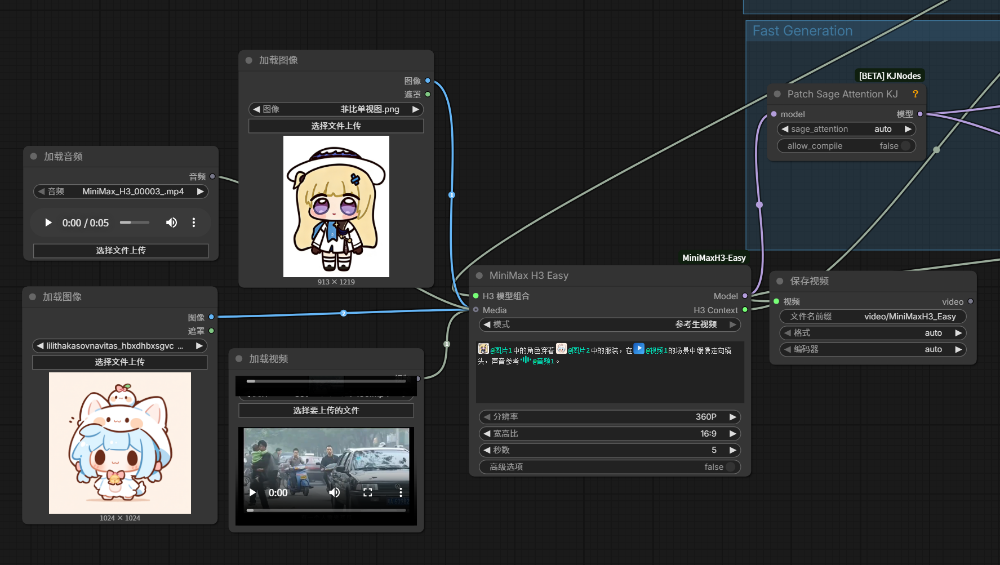
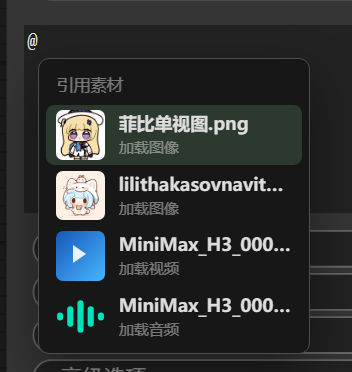

# ComfyUI-MiniMaxH3-Studio

[English README](README.md)

给 MiniMax H3 用的剧本编辑器：把官方那套六段式参考语法藏起来，只让人填内容。
在 `MiniMax H3 Easy` 节点上多一个 **📝 编辑剧本** 按钮，点开就是全部功能。

编号、时间码、`<d>` 标签、保留声明、官方绑定句，全部在保存时自动拼出来。

另外还带上了新装一次最容易卡住的两样东西：**一键下载全部模型**，以及
**只用 ComfyUI 核心节点的示例工作流**。

<p align="center">
  
</p>

<sup>图片、视频、音频共用一个可排序的 `Media` 输入，提示词里用 `@名字` 直接引用。
剧本编辑器就架在这套素材机制上。</sup>

---

## 安装

```bash
git clone https://github.com/coasho/ComfyUI-MiniMaxH3-Studio.git
```

克隆到 `ComfyUI/custom_nodes/` 下，装一下可选依赖，然后重启：

```bash
pip install -r ComfyUI-MiniMaxH3-Studio/requirements.txt
```

三个节点本身不需要 ComfyUI 自带之外的任何东西。`requirements.txt` 只服务于编辑器的
可选功能（反推、音色）——缺哪个就是哪个功能报一句话，节点照常工作。

**强烈建议 ComfyUI ≥ `bdcb886`（2026-08-06 nightly）。** 那个提交加入了原生的
MiniMax-H3 音画流采样（`ModelSamplingAV`）；在此之前用 4 步 Turbo LoRA，声音会严重破音。
示例工作流是按 Turbo LoRA 配的。

音色生成还需要另外装 [ComfyUI-Qwen3-TTS](https://github.com/lrzjason/ComfyUI-Qwen3-TTS)，
本包驱动的是它的 TTS 节点类。

---

## 一键下载模型

H3 的权重分散在三个 HuggingFace 仓库里，名字几乎一模一样，跑起来前要凑齐六个文件。
别手抄链接。

打开 **MiniMax H3 加载器** 节点，点 **⬇ 下载模型**：有什么、缺什么、还差多少字节，
一目了然。反推弹窗和音色工作台在模型缺失时也会出现同一个按钮。

也可以不开 ComfyUI，直接在终端跑：

```bash
python ComfyUI/custom_nodes/ComfyUI-MiniMaxH3-Studio/download_models.py --list
```

```bash
python ComfyUI/custom_nodes/ComfyUI-MiniMaxH3-Studio/download_models.py --required
```

| id | 必需 | 体积 | 落到哪 |
|---|---|---|---|
| `h3_ref2va` | ✔ | 19.5 GB | `models/diffusion_models/` |
| `h3_fl2va` | ✔ | 19.5 GB | `models/diffusion_models/` |
| `h3_text_encoder` | ✔ | 14.6 GB | `models/text_encoders/` |
| `h3_text_encoder_int8` | — | 25.3 GB | 非 50 系显卡的备选 |
| `h3_vae` | ✔ | 5.4 GB | `models/vae/`（视频 + 音频两个）|
| `h3_turbo_lora` | ✔ | 592 MB | `models/loras/` |
| `qwen3vl_caption` | — | 8.3 GB | `models/LLM/Qwen3-VL-4B-Instruct/` |
| `wd14_tagger` | — | 1.2 GB | 装了 `comfyui-wd14-tagger` 就复用它的 models 目录 |
| `tts_voicedesign` | — | 4.2 GB | `models/TTS/Qwen/…-VoiceDesign/` |
| `tts_base` | — | 4.2 GB | `models/TTS/Qwen/…-Base/` |

几个实际会救命的细节：

- **断点续传。** 下载写在目标旁边的 `.part` 上，从上次断的位置接着下——取消、关
  ComfyUI、断网都行。`huggingface_hub` 的 `snapshot_download(local_dir=…)` 在 Xet
  存储上没有断点，杀掉进程几个 GB 全丢，所以这里用裸 `Range` 请求配自己的读超时。
- **不存第二份。** 直接落到 ComfyUI 的 models 目录，不经过 `~/.cache/huggingface`。
- **镜像。** 设 `HF_ENDPOINT=https://hf-mirror.com` 就走镜像。
- **校验。** `.safetensors` 要先过自己的头部校验才改名到位，半个文件不会被当成就绪。
  已经在本地的文件只要能自校验就认，不比对清单里的字节数（同一权重的不同 repack
  会差几十字节，按大小判会让人白下 19.5GB）。

---

## 示例工作流

`example_workflows/` 里两张图，**只用 ComfyUI 核心节点 + 本包的三个节点**——
不需要 KJNodes、不需要 wavespeed、不需要任何改过的采样器。

| 文件 | 模式 | 需要 |
|---|---|---|
| `MiniMax_H3_Studio_Reference.json` | 参考生视频 | `h3_ref2va` + 文本编码器 + VAE + Turbo LoRA |
| `MiniMax_H3_Studio_TextToVideo.json` | 文生视频 | `h3_fl2va` + 文本编码器 + VAE + Turbo LoRA |

两张都预置了一小段演示剧本，打开编辑器看到的是填好的结构而不是空表单。
参考版指向 ComfyUI 自带的 `input/example.png`，换成你自己的设定稿即可。

---

## 一、实体模型

**官方的 `<Subject N>` 不只是「角色」。** 它是任意可复用的声明实体，
官方的 visible content type 全集是：

| 类型 | 官方短语 | 默认保留等级 |
|---|---|---|
| 人物 | `identity and appearance` | fully_preserved |
| 物件 / 服装 / 道具 | `visible object appearance` | fully_preserved |
| 场景 / 环境 | `scene and environment` | fully_preserved |
| 动作 / 姿态 | `pose and movement` | **attribute_transfer**（必须指定迁移目标）|
| 画风 | `visual style` | weak_reference |
| 画外音 | 无（不占 Subject 编号）| — |

绑定句模板：`The {短语} of <Subject 1> {is|are} defined by <Picture 1>.`
**一个实体可以绑多个素材**（正面图 + 侧面图 + 服装细节各一张）。

### 两套编号互不相干

- `<Subject N>` 按**实体表顺序**编号，只有「出现在画面里」的占号
- `(S1)(S2)` 按**首次开口顺序**编号，**从不开口的实体不给编号**

所以完全可能出现 `<Subject 2> (S1)`。卡片右上角实时显示实际会发出去的编号。

### 常见场景怎么表达

| 想做的事 | 怎么做 |
|---|---|
| 多角色对话 | 建多个「人物」实体，台词卡上选说话人 |
| 每个角色不同音色 | 每个实体各绑各的音色素材 |
| 中途换衣服 | 建两个「物件」实体，在分镜的**变更**里写「A 脱下 校服」「A 穿上 红外套」 |
| A 把东西交给 B | 变更选「交给」，三个槽：谁 / 什么 / 给谁 |
| 千奇百怪的变化 | 变更选「自定义」，自己写一句，里面照样能 `@` 引用实体 |
| 没有人物，只有物件/景色 | 只建物件和场景实体，一句台词不写。校验不会报错 |
| 角色说日语、另一个说中文 | 每个实体单独设语言，`<d>[Lang]` 逐句按实体发送 |

### `@` 引用

画面描述、变更、概述、环境音里都能写 `@实体名`，保存时替换成 `<Subject N>`。
按 `@` 直接弹出补全列表，↑ ↓ 选、回车插入。
引用不到的实体标红并进校验。

<p align="center">
  
</p>

---

## 二、图生文反推（🔍 反推描述）

准备好参考图后不用再手写外观特征。实体卡上每条素材绑定旁边点一下。

两个模型协作，**不是二选一**：

| 模型 | 体积 | 职责 |
|---|---|---|
| `SmilingWolf/wd-eva02-large-tagger-v3` | 1.2 GB ONNX | 二次元离散属性抽取（v3 系列 F1 最高 0.4772）|
| `Qwen/Qwen3-VL-4B-Instruct` | 8.3 GB bf16 | 成句描述，写实与二次元通用 |

二次元图先用 WD14 抽标签当**事实依据**喂给 VLM，并明确告诉它标签在发色瞳色
服饰上比自己看的准。写实照片关掉标签直接走 VLM。

第三个后端是 **OpenAI 兼容接口**（Ollama / LM Studio / 云 API），零下载，
想换更强的模型直接在弹窗里填 URL。

### 设定稿版式会被自动挑出来

WD14 会同时抓到 `multiple views / turnaround / white background / spread arms`
这类**版式标签**。它们描述的是「这是一张设定稿」而不是角色长什么样，混进
描述会被 H3 当画面内容照搬（三视图白底和张臂站姿被搬进成片是真实发生过的）。

这些会被分离出来转成中文的**「不保留」候选**，反推完直接勾选加进剧本。
视角类标签只在**确认是设定稿时**才建议丢弃——单张侧脸特写里的 `profile`
是真实构图，不该误删。

---

## 三、音色生成（🎙 做音色）

**「大妈声」的根因是没得挑，不是模型烂。** VoiceDesign 是随机采样，
同一段描述换个 seed 音色差很远（实测组内相似度 0.989，确实在飘）。
所以核心是**一次出多条候选并排试听**。

| 来源 | 需要模型 | 说明 |
|---|---|---|
| 描述生成 | `Qwen3-TTS-12Hz-1.7B-VoiceDesign` 4.2 GB | 自由描述嗓音，随机采样，所以要多出几条挑 |
| 克隆参考音频 | `Qwen3-TTS-12Hz-1.7B-Base` 4.2 GB | `x_vector_only` 从参考音频提音色向量复刻，不靠抽卡 |

**不用 CustomVoice**（Vivian 那套固定预设），实测就是「大妈声」的来源。

实测音色一致性（MFCC 余弦）：描述生成组内 0.989，克隆组内 0.997，
克隆跨参考 0.980 —— 克隆更稳，且参考确实决定音色。
（该指标在短片段上往 1.0 饱和，动态范围窄，以听感为准。）

- **试听文本默认取该实体在剧本里的第一句真实台词**，听到的就是成片会说的那句
- 选中的音色落盘到 `input/h3voice_*.wav`，跨剧本复用、跨进程持久化
- 选中后**自动在图里建 `LoadAudio`、填好文件名、登记成 media、绑给该实体**，
  不用手工连线；同一文件重复选会复用已有节点

> 音色文件必须放 `input/` **根目录**：`LoadAudio` 用 `os.listdir(input_dir)`
> 列文件，不递归，放子目录下拉框根本选不到。

---

## 四、中文编辑，英文输出

编辑中文效率最高，但 H3 要英文。保存时所有散文字段走一趟 **Qwen3-VL 翻译**——
不是查表——同时：

- **台词正文一个字不动**（那是角色真要说出口的话）
- `<Subject 1>`、`(S1)`、`@引用`、`<d>` 标签在翻译前被占位符换掉，译完再还原，
  模型碰不到它们
- 颜色排除项（`dark brown, NOT black, NOT auburn`）在翻译之后用英文确定性补齐——
  H3 要求每个颜色都写明不许漂向哪个邻近色，否则深发会飘成橙发；而实测同一版指令下
  VLM 自己补的覆盖率在 **0% / 25% / 62%** 之间乱跳，靠不住

中文原文留在节点里，随时可以继续改。

---

## 五、显存与内存

反推的 VLM 8 GB、音色模型 4 GB，跟 H3 抢显存必爆。所以：

- `MiniMaxH3Easy.generate()` 开头先把两个都卸掉
- 各有一个空闲 10 分钟自动卸载的守护线程
- 关掉反推/音色弹窗、保存完成、生成完成，各触发一次显式释放：接进 ComfyUI 的
  `free_memory`、`gc` ×3、`empty_cache`、`ipc_collect`，Windows 上还调
  `EmptyWorkingSet` 把内存页还给系统

16 GB 卡实测峰值：反推 8.78 GB，音色 4.09 GB。

> 卸载时**绝不** `.to("cpu")`。那会把 8GB 权重从显存搬进内存然后留在那里
> （实测 RSS 0.83 → 7.63 GB），反过来把 ComfyUI 自己饿死。

---

## 六、非官方项

面板上标「非官方」的字段，官方**没有**对应受控词表，只作为普通英文写进描述：

- **景别**（特写 / 中景 / 远景…）
- **机位角度**（平视 / 仰拍 / 荷兰角…）

官方也**没有**「广角」「微距」这类镜头焦段词。
运镜 / 幅度 / 速度是官方词表，且**幅度与速度官方只有两档**（small/large、slow/fast）。

---

## 七、文件

| 文件 | 作用 |
|---|---|
| `nodes.py` | 三个节点：Loader / Easy / Output |
| `download_models.py` | 模型清单、断点续传下载器、HTTP 路由、命令行 |
| `caption.py` | 图生文反推与保存时翻译的 HTTP 端点 |
| `voice.py` | 音色生成的 HTTP 端点 |
| `vram.py` | 显存/内存释放，接进 ComfyUI 的 `free_memory` |
| `web/h3_grammar.js` | **语法 schema，唯一事实来源**。扩展语法只改这里 |
| `web/h3_script_editor.js` | 数据模型 + 提示词拼装 + 校验 + 版本迁移 |
| `web/h3_script_modal.js` | 编辑器弹窗 |
| `web/h3_caption.js` | 反推弹窗 |
| `web/h3_voice.js` | 音色工作台弹窗 |
| `web/h3_models.js` | 模型下载面板 |

### 设计原则

**结构只用在 H3 语法要求机器精确的地方**——Subject/Speaker 编号、时间码、
`<d>` 标签、保留声明、官方绑定句。其余一律是散文 + `@` 实体引用。

v2 恰好搞反了：把景别语气这些散文结构化成下拉框，却把真正要算的编号写死，
于是衣服、道具、纯景色片全都表达不了。

### 剧本版本迁移

`v1（单角色 speaker）→ v2（角色表）→ v3（实体模型）` 全通。
`assemble()` 内部兜底迁移，没打开过编辑器直接点生成也不会出错。

---

## 致谢

节点层——单一可排序的 `Media` 输入、`@` 提及式提示词编辑器、拖线快速建节点——
来自 [nkxx188/ComfyUI-MiniMaxH3-Easy](https://github.com/nkxx188/ComfyUI-MiniMaxH3-Easy)（MIT）。
本包在它之上做了剧本编辑器、图生文反推、音色工作台和模型下载器。

## 许可证

MIT，见 [LICENSE](LICENSE)。
